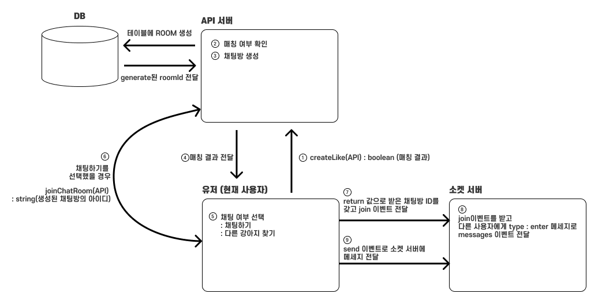

# Dangder

860만 반려동물 시대를 맞이한 대한민국! (기사) 🐶 애견인들은 이미 다양한 커뮤니티 안에서 여러 활동을 하고 있습니다. 반려동물의 다양한 경험과 활동을 위해 열심을 다하는 애견인들을 위한 프로젝트 🐾 ‘Dangder’ (댕더)는 반려견의 Play-Mate 를 찾아 함께함을 통해 반려견(댕댕이)‘멍라밸'의 질을 높이기 위한 서비스로, 친구와 함께 할 때 더 즐거워하는 사랑스러운 우리 댕댕이들을 위해 플랫폼을 통해 산책, 간식, 애견카페(애견수영장, 애견캠핑 등..) 탐방을 함께 할 친구를 찾고, 서로 마음이 맞는 친구를 매칭시켜 채팅을 통해 함께 만나 볼 수 있는 기능을 제공하여 더 행복한 멍라벨을 누릴 수 있도록 지원하는 애견인과 댕댕이를 위한 프로젝트입니다. 🦴

## 목차
- [구현 내용](#1)
- [회고](#2)
- [기술 스택](#3)
- [실행 방법](#4)

## 구현 내용 <a id="1"></a>

### 담당 업무 
- 깃 관리자 
- 프론트엔드 리드 
- 회원가입, 로그인, 비밀번호 재설정, 댕댕이 등록, 나의 댕댕이 정보 수정 기능 구현
- 공통 컴포넌트 구현 
- 1:1, 그룹 채팅 관련 로직 및 기능 구현
- 댕더 패스권 구매 모달 및 기능 구현 
- 매칭 로직 및 매칭 모달 및 기능 구현
- 신고 기능 구현
- 리뷰 기능 구현

### 컴포넌트 합성을 사용하여 팀원들이 사용하기 쉬운 공통 모달 컴포넌트 개발

팀원들이 모달을 더 쉽게 사용할 수 있도록 공통 모달 컴포넌트를 개발하였습니다. 기존에 antd의 모달 컴포넌트를 사용하기로 했지만 디자인적인 이유로 모달 안에서 사용되는 레이아웃의 변경이 필요했습니다. antd 모달에서 기본 형태로 사용되고 있는 버튼의 모양과 위치도 변경할 필요가 있었는데 모달을 사용할 때마다 개발 기간이 짧은 팀원들이 커스텀 하여 사용하기에는 무리가 있다고 판단이 들었습니다.

어떻게 팀원들이 모달의 내부를 구현하는 것에만 집중할 수 있도록 컴포넌트를 만들 수 있을까 고민하였고, 고민 끝에 컴포넌트 합성을 사용해서 문제를 해결하기로 결정하였습니다. 

팀원들이 내부 레이아웃 및 기능을 구성하는 것 외에 외부 dim 처리, 위치나 모양, 열리고 닫히는 것에 신경을 덜 쓸 수 있도록 CustomLayoutModal 컴포넌트를 구현하고 props를 통해 팀원들이 구성한 엘리먼트를 자식 엘리먼트로 받아 모달을 띄울 수 있도록 했습니다. 이를 통해 프론트엔드 개발자로서 사용자의 입장에서 생각하여 개발하는 자세를 배우게 되었습니다. 

https://github.com/hyejineee/dangder-client/blob/7d6de736edf004aa8f33cbabd6bef77284a6131a/src/Components/Commons/Modal/CustomLayoutModal/CustomLayoutModal.tsx#L48-L76


### 협업을 통해 채팅을 위한 메세지 프로토콜 정의

먼저 채팅을 구현하기 위해서 사용자가 채팅방으로 들어오는 과정까지의 로직을 정리할 필요가 있었습니다. 다양한 페이지에서 다양한 경우의 수로 사용자가 입장하기 때문에 로직을 정리하지 않고서는 제대로 에러에 대응할 수 없다는 생각이 들게 되었습니다. 다이얼그램을 그리면서 좋아요 기능과 채팅방 생성이 어떻게 이어지는지 정리를 하고 백엔드 개발자 분과 의논하는 시간을 가졌습니다. 그 과정에서 채팅방과 관련된 API가 fetchChatRoom, createChatRoom, joinChatRoom이 있다는 것을 알게 되었고 그 중에서 joinChatRoom만 클라이언트에서 사용할 수 있다는 것을 알게 되었습니다. 



그 이후에 채팅을 담당하는 백엔드 개발자와 채팅 시 주고받을 emit과 on에 대한 이벤트를 정의하였습니다. 메시지의 종류에 일반 텍스트 메시지, 장소 공유 메시지, 약속 공유 메시지가 있기 때문에 이를 프론트에서 처리하기 위해서는 어떤 종류의 메시지이지 나타내는 type과 type에 해당하는 데이터가 필요했습니다. 백엔드 개발자와 메시지의 형태에 대해서 의논하고, 데이터가 디비에 어떻게 저장되어야 할지까지 의논한 뒤 소켓에서 주고받을 메시지의 프로토콜을 정하였습니다. 

이를 통해 프론트엔드 개발자와 백엔드 개발자가 서로 데이터를 바라보는 시각이 다르다는 것을 배우게 되었고, 백엔드와 소통할 때 어디까지 생각해야 하는지 배울 수 있는 시간이 되었습니다.

### 스크린샷
<details>
  <summary>매칭 성공 모달</summary>
    <div markdown="1" style="display : flex;">
       
    </div>
</details>

<details>
  <summary>댕더 패스권 구매</summary>
    <div markdown="2" style="display : flex; gap : 8px">
       
    
    </div>
</details>

<details>
  <summary>매칭 후기</summary>
    <div markdown="1">
      
    </div>
</details>


<details>
  <summary>채팅</summary>
    <div markdown="1">
       
    </div>
</details>

<details>
  <summary>관심사 그룹 채팅</summary>
    <div markdown="1" style="display:flex; gap:8px">
       
        
    </div>
</details>

## 회고 <a id="2"></a>

프론트엔드 개발자로서 처음 진행한 팀 프로젝트이기 때문에 처음에 잘 할 수 있을까. 백엔드와 잘 소통할 수 있을까에 대한 걱정이 앞섰습니다. 디자이너나 기획자도 없이 저희끼리 처음부터 끝까지 구현해야 했기 때문에 큰 부담으로 다가왔습니다. 하지만 이전에 안드로이드 개발자로서 아르바이트를 했던 경험과 산업디자인과 학부생때 서비스를 기획하고 디자인 했던 경험이 많은 도움이 되었습니다. 

처음 백엔드 개발자와 소통하면서 프로젝트를 진행하였는데 프론트에서 에러가 발생했을 때 어떤 부분을 보고 백엔드 개발자에게 수정을 요청해야 하는지 배울 수 있는 시간이 되었습니다. 또 데이터의 형태나 저장 방식에 대해서 백엔드 개발자와 의논하면서 서로 데이터를 바라보는 시각이 다르다는 점을 알게 되었습니다. 덕분에 데이터를 통으로 보는 시점에서 여러 부분으로 쪼개고 연결된 관계로 보는 시점으로 데이터를 바라보는 시야를 확장할 수 있었습니다.

## 기술 스택 <a id="3"></a>

          

## 실행 방법 <a id="4"></a>
**API 서버 운영 중단으로 기능이 정상적으로 동작하지 않을 수 있습니다.**

1. 프로젝트를 클론합니다.
```
git clone https://github.com/hyejineee/dangder-client.git
```
2. 클론한 프로젝트 내부로 이동합니다. 
```
cd dangder-client
```
3. 의존 패키지를 설치합니다. 
```
yarn
```
4. 다음 명령어를 사용하여 서버를 실행합니다.
```
# 클라이언트 실행
yarn dev 
```
